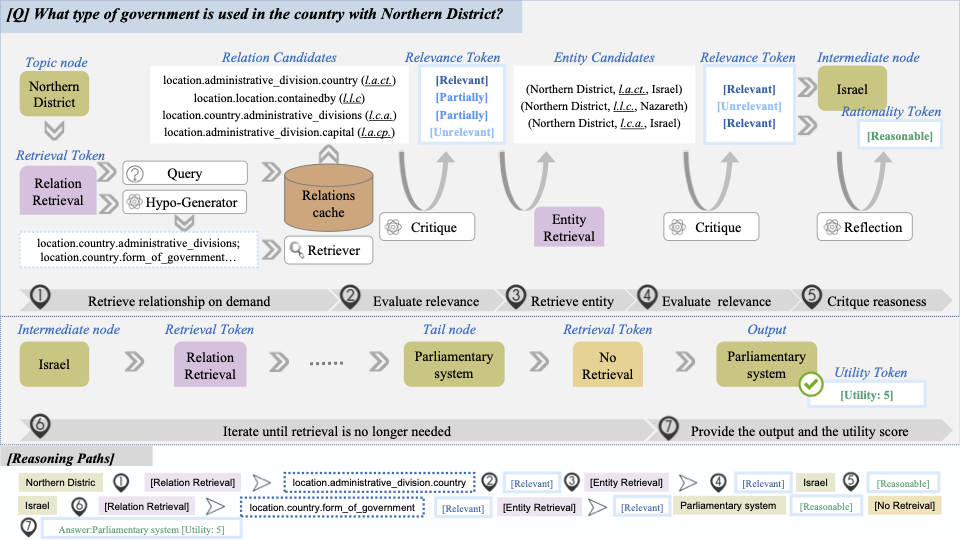

Official implementation of the paper "Learning to Retrieve and Reason on Knowledge Graph through Active Self-Reflection" . We warmly welcome discussions on KBQA together!\



## Training

### Data Creation
We extracted the paths in the knowledge graph through relation paths and generated training data. Specifically, we first extracted possible paths connecting two entities from the knowledge graph, and then generated training data based on these paths.

```
# process relation data
python -m src.data_creation.relation_data --split train --dataset webqsp --save_path ./output/chain_data/webqsp_train_chain_top_5.json

# create training data
python -m src.data_creation.generate_data

# composite spiecial tokens
python -m src.data_creation.composite_data
```

## Inference

```
python -m src.inference
```